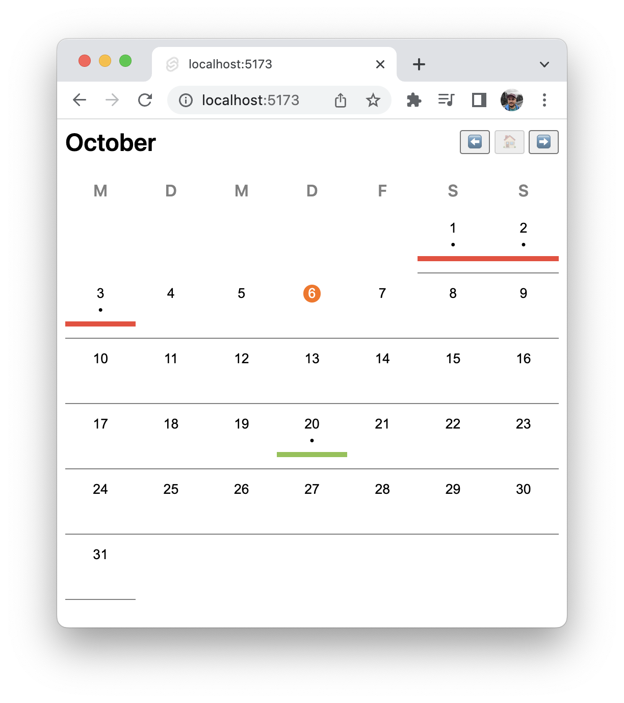

# Calendar.svelte

This is a simple single Svelte component to help create a calendar view. It's not headless, but allows you to pass the date cell as a slot, for more flexibility of how and what each cell displays.

[View it in action!](https://calendar-svelte.vercel.app/)

Look at [`src/routes/+page.svelte`](src/routes/+page.svelte) for usage, and [`src/lib/Calendar.svelte`](src/lib/Calendar.svelte) for implementation. Feel free to copy this code to you own project, since I didn't bother publishing it to npm as a package.

# API

## [Props](https://svelte.dev/docs#template-syntax-attributes-and-props)

- **start_on_sunday** _boolean_
  - starts a week on sunday instead of monday, false by default
- **view_date** _Date_
  - sets the month the view starts in

## [Style Props](https://svelte.dev/docs#template-syntax-component-directives---style-props)

- --header-margin
- --month-font-weight
- --month-font-size
- --week-days-color
- --week-days-font-weight
- --week-days-margin
- --cell-height
